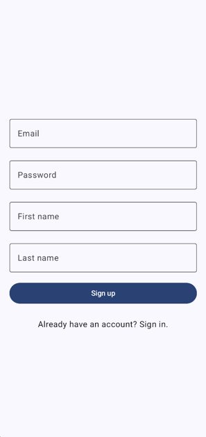
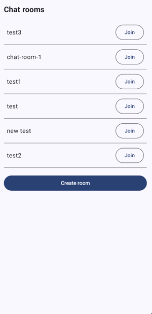
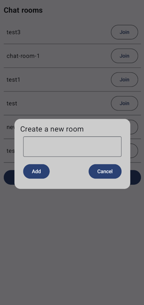
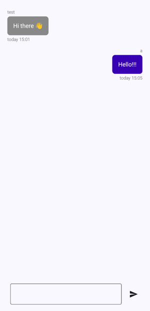
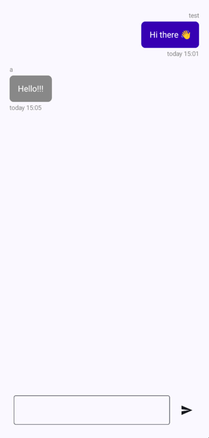

# ChatRoom

### Android chat app with registration, authorization, ability to create chats and send text messages to them

## Used technologies and tools

- Kotlin
- Android SDK
- Jetpack Compose
- Mutable States
- LiveData
- Navigation
- MVVM design pattern
- Firebase

*This project was developed as part of The Complete Android 14 & Kotlin Development Masterclass by TutorialsEU*

*Minimum supported Android version is **Android 7 (Nougat)** but recommended is **Android 8 (Oreo)***

## Illustrations

### Sign up screen

### Sign in screen

### Home screen

### Creating new chat room

### Chat screen

### Chat screen (another user)

